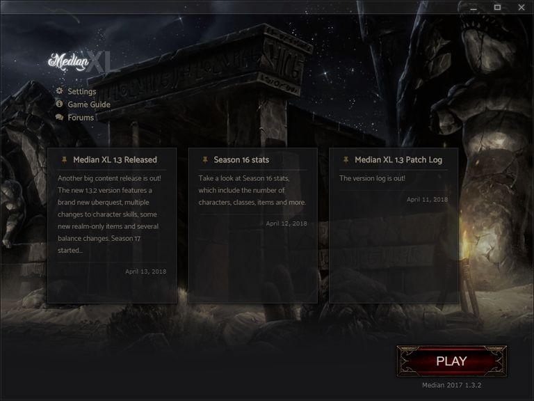
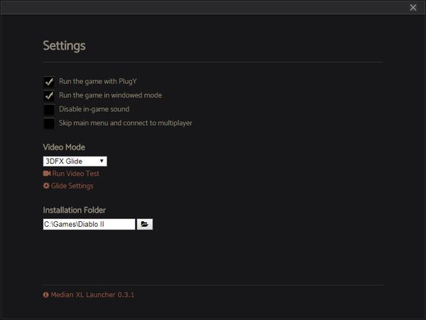

# Median XL Launcher

This repository is used to create the Launcher, Setup and Updates for [Median XL](https://www.median-xl.com/). Median XL is the most popular Diablo II overhaul modification, an action RPG with extensive endgame content, deep character customisation and challenging gameplay.

The Median XL Launcher takes care of:
* seamlessly installing and updating Median XL
* compatibility issues with Diablo II
* file version mismatches & corruptions
* easy manipulation of Diablo II settings

It is built on [Node.js](https://nodejs.org/) & [Electron](https://electronjs.org/), and compiled to Setup & Update files via [Inno Setup](http://www.jrsoftware.org/isinfo.php) scripts. Archives are handled with [7-zip](https://www.7-zip.org/), and versions are patched/updated with delta files created with [Xdelta3](http://xdelta.org/).

____

## Quick Guide

Source code and assets/resources are in [dev\resources\app](dev\resources\app), [dev\resources\external](dev\resources\external), and [installer](installer).  
[make.bat](make.bat) creates the Launcher files/setup/update.  
[dev_test.bat](dev_test.bat) runs the dev test version of the Launcher, which is useful for quickly testing code without building every time.  
For additional building and details, see [BUILD](BUILD.md).

## Screenshots of the Launcher
  

## License